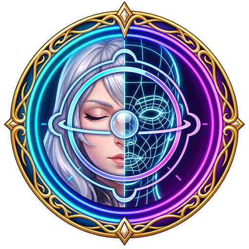

# Briosis



[](https://github.com/SHIGYL/Briosis/actions/workflows/build.yml)
[](https://github.com/SHIGYL/Briosis/releases/latest)
[](LICENSE)

Briosis is a community fork and mash-up built on [Brio](https://github.com/Etheirys/Brio), with expanded facial posing adapted from and inspired by [Ktisis](https://github.com/ktisis-tools/Ktisis). It is not an official Brio or Ktisis release.

## Features

- Brio-based GPose actor, posing, animation, appearance, scene, camera, lighting, and world tools
- Ktisis-style facial expression controls
- Facial Presets with persistence and optional manual-bone adjustments
- Geometry-normalized procedural `Tongue Out` control
- Reusable Tongue Profiles and a Tongue Tool for root/body/tip tuning
- Manual tongue-bone shortcuts for fine tuning
- Undo/Redo integration for facial-expression editing

## Installation

1. Open `/xlsettings` in FFXIV.
2. Select **Experimental**.
3. Under **Custom Plugin Repositories**, add:

   ```text
   https://raw.githubusercontent.com/SHIGYL/Briosis/main/repo.json
   ```

4. Enable the repository and click **Save**.
5. Open `/xlplugins`.
6. Search for **Briosis** and select **Install**.

Updates are delivered through the same custom repository. Use `/briosis` to open the main window.

## Compatibility note

Briosis and the original Brio use many of the same game hooks and retain compatible internal `Brio.*` namespaces and file formats. Their simultaneous runtime operation is not supported. Disable Brio before enabling Briosis.

Briosis has its own Dalamud identity (`Briosis`), assembly (`Briosis.dll`), configuration directory, preset/profile storage, temporary cache, Penumbra temporary collections, command (`/briosis`), and update channel. It does not install or update over Brio.

The inherited optional `/xat` and `/mcdf` aliases, Brio IPC contract names, and local web API endpoint are retained for compatibility. They may conflict if Brio is also enabled, which is another reason not to run both plugins at once.

## Building

Requirements:

- Windows
- .NET 10 SDK
- a current Dalamud development installation compatible with API level 15
- Git submodules initialized

Build the release package with:

```powershell
git submodule update --init --recursive
dotnet restore Briosis.slnx
dotnet build Briosis.slnx --configuration Release --no-restore
```

DalamudPackager writes the installable archive as `latest.zip` below `Brio/bin/x64/Release/Briosis/`. Release automation publishes the same archive as `Briosis.zip`.

## Credits

Briosis is maintained by SHIGYL and is derived from GPL-3.0 projects:

- [Brio](https://github.com/Etheirys/Brio) by Etheirys, its maintainers, and contributors
- [Ktisis](https://github.com/ktisis-tools/Ktisis) by ktisis-tools and contributors

Facial-control schemas and portions of the facial blend/propagation behavior were adapted from Ktisis. Briosis preserves Brio's architecture and namespaces where changing them would create unnecessary risk and make upstream comparison harder.

See [Acknowledgements.md](Acknowledgements.md) for additional upstream projects and notices.

## License

Briosis is distributed under the [GNU General Public License v3.0](LICENSE). Upstream copyright and attribution remain with their respective authors.
